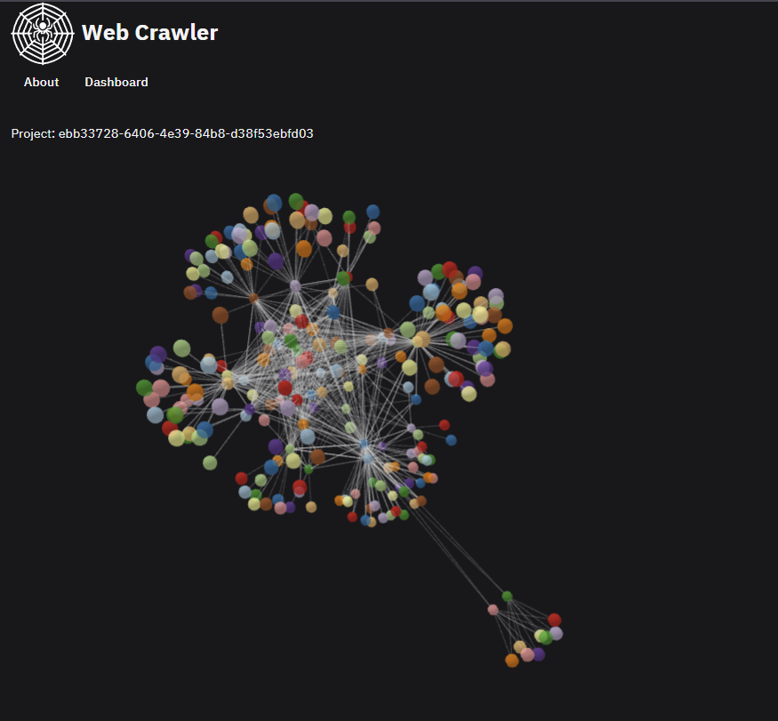

# :globe_with_meridians: Web Crawler

---

<div align="center">


### Branch status

| Branch  | Pipeline status                                                                                                                                          | Coverage                                                                                                                                                    |
|---------|----------------------------------------------------------------------------------------------------------------------------------------------------------|-------------------------------------------------------------------------------------------------------------------------------------------------------------|
| `main`  | [](https://gitlab.crja72.ru/gospec/go1/web-crawler/-/pipelines) | [](https://gitlab.crja72.ru/gospec/go1/web-crawler/-/pipelines) |
| `dev`   | [](https://gitlab.crja72.ru/gospec/go1/web-crawler/-/pipelines)  | [](https://gitlab.crja72.ru/gospec/go1/web-crawler/-/pipelines)  |


Web Crawler is a scalable and efficient tool for collecting information from websites. It supports crawling web pages, extracting their content, and following links to other pages. Designed with a microservice architecture for performance and flexibility.



</div>

---

## Installation

### Production

To run the project in production mode:

1. Use start script (choose yes for default .env variables):
   ```shell
   bash scripts/start.sh
   ```
2. Install [Docker](https://www.docker.com).
3. Run the following command:
   ```bash
   docker compose -f deployments/docker-compose.yml up --build
   ```
4. If you did not change the ports in `configs/.env`, then the web interface will be available at `http://localhost:85`.


### Development

#### Pre-setup

To run the project in development mode:
1. Configure environment variables in `configs/.env` (use `configs/.env.template` as a template).
2. Install [Docker](https://www.docker.com/).
3. Run the following command:
    ```bash
    docker compose -f deployments/docker-compose-dev.yml up --build
    ```
   In this mode, all third-party containers will be deployed with ports forwarded to `localhost`.

#### Setup

1. Install [Go](https://golang.org/).
2. Install dependencies:
    ```bash
    go mod download
    ```
3. To run frontend:
    ```bash
    cd frontend
    npm run dev
    ```
4. Install [Npm](https://nodejs.org/en/download/package-manager)
5. To run backend service run the following command:
    ```bash
    go run cmd/<path_to_service>/<service>.go
    ```
   
---

### Testing

#### Unit Tests

To run backend unit tests, execute the following command:
```bash
go test ./... -v
```

To run frontend unit tests, execute the following command:
```bash
cd frontend
npm run test
```

#### Integration Tests

1. Start the project in development mode.
2. Run the following command:
    ```bash
    go test ./... -v
    ```

To view detailed test coverage:
```bash
go test ./... -coverprofile coverage.out
go tool cover -html=coverage.out -o coverage.html
```
Open `cover.html` to view the detailed coverage report.

---

### Linting

#### Backend

To lint the backend, install [golangci-lint](https://golangci-lint.run/usage/install/):
```bash
golangci-lint run -c configs/.golangci.yml
```

#### Frontend

To lint the frontend, run the following command:
```bash
cd frontend
npm run lint
```

---

### Documentation

#### API Documentation

To build the API documentation, run the following command:
```bash
npx @redocly/cli build-docs api/openapi.json -o docs/api/apiDocumentation.html
```
Documentation is now available at `docs/api/apiDocumentation.html`

---

### Folder Structure

This project follows the [Standard Go Project Layout](https://github.com/golang-standards/project-layout)
